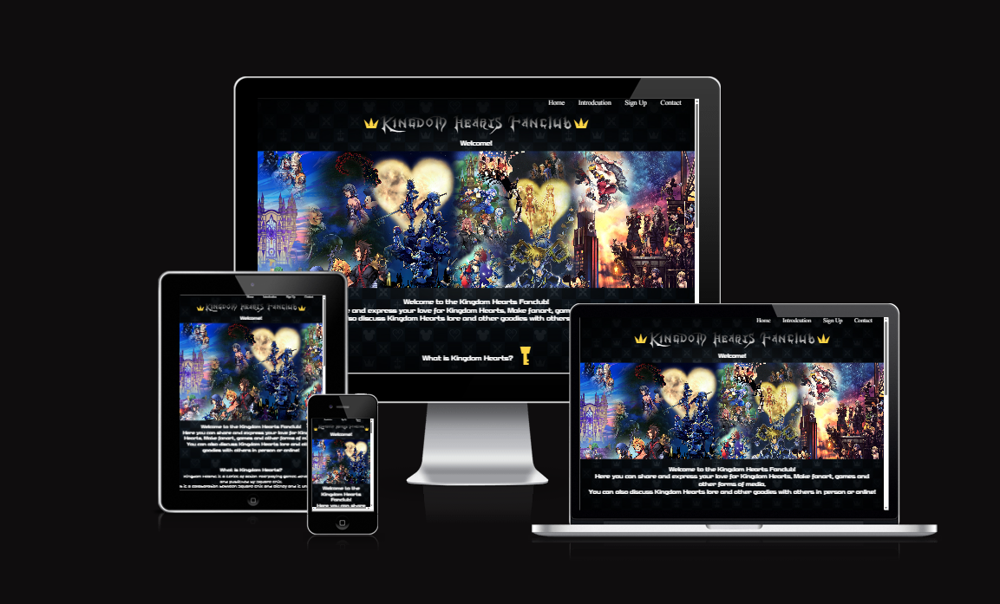
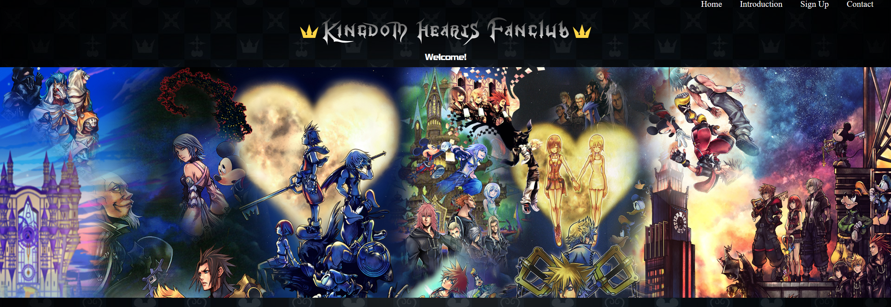
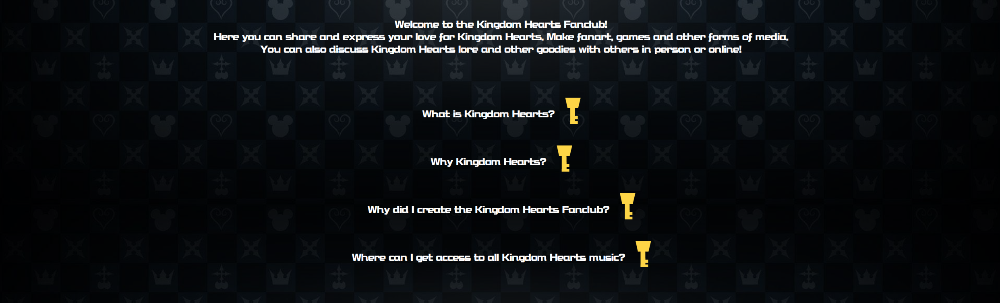
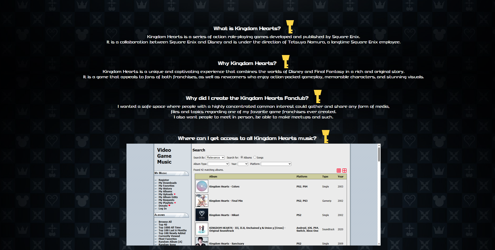
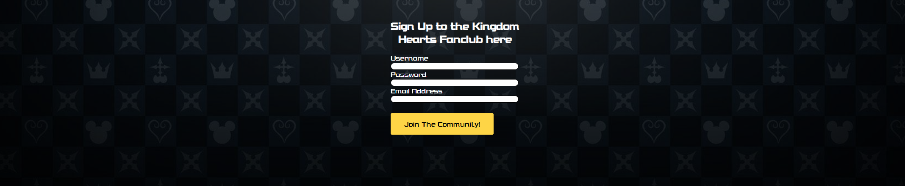
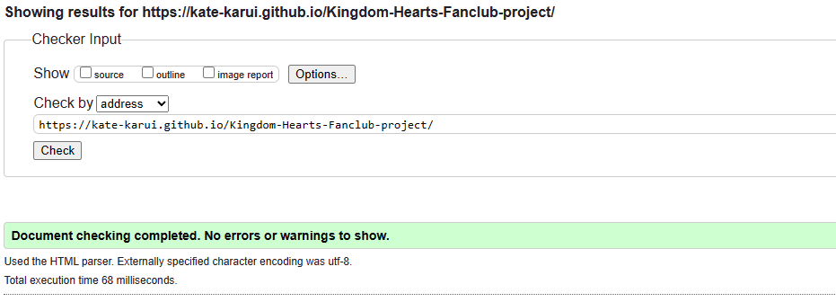
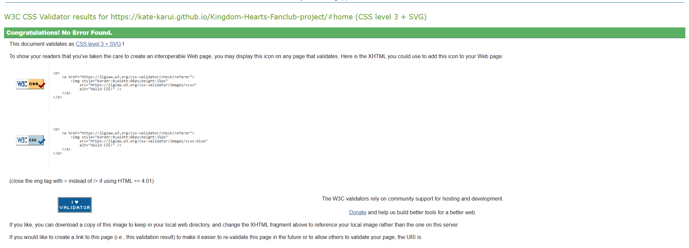
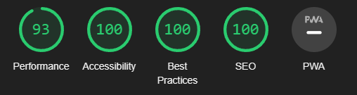

<h1>Kingdom Hearts Fanclub</h1>
The Kingdom Hearts Fanclub is a website for fans of the Kingdom Hearts game series by Square Enix and Disney. It is a place where you can:
 
<ul>
<li>Share and enjoy fan-made content such as art, games, videos, music and more.</li>
<li>Discuss and learn about the lore, characters, worlds and themes of Kingdom Hearts.</li>
<li>Connect and socialize with other fans online or in person through chat rooms, forums and meetups.</li>
</ul>

 

<h1>Features</h1>
<ul>
    <li><b>Navigation & Header</b></li>
    <ul>
    
<li>It has navigation bar that brings you to the relevant sections.</li>
<li>It goes Home, Introduction, Sign Up and Contact.</li>
<li>It uses font from the Kingdom Hearts series.</li>
<li>The navigation bar is easily readable and easy to navigate.</li>
<li>The header has a pretty image summarizing Kingdom Hearts compiled by someone on Deviantart.</li>
<li>The h1 uses the Kingdom Hearts font with CSS coloring it.</li>

</ul>
<b><h2>Introduction & FAQ</h2></b>
<ul>
<li>Introduction to introduce people to the website.</li>
<li>Interactive keys that reveal contents when pressed.</li>
<li>It contains answers, with answers to questions that someone might have.</li>
<li>The last question contains an Iframe leading to a site that contains music.</li>
</ul>

<h2><b>Sign Up Forum</b></h2>
<ul>
<li>A sign up forum that sends data to Code Institute's formdump.</li>
<li>The form collect Username, Password and Email Address.</li>
<li>It enables people to signup to Kingdom Hearts Fanclub to give access to its content.</li>
</ul>

<h2><b>Contact & Copyright Information.</b></h2>
<ul>
<li>Contact information on where to find me.</li>
<li>Copyright information brought from the Kingdom Hearts website stating that I don't own the characters or the franchise.</li>

</ul>

<h1><b>Testing</b></h1>
<ul>
<li>I tested that it works in Chrome, Firefox and Opera.</li>
<li>I confirmed that the site is responsive and looks good on Phone.</li>
<li>I confirmed that the navigation bar works and is easy to understand.</li>
<li>I have confirmed that the form works and is required, also that it sends the correct information.</li>
</ul>

<h2><b>Bugs</b></h2>
<ul>
<li>There's a point where the responsive design looks weird when transitioning to the max-width.</li>
</ul>
 
<h2><b>Validator Testing</b></h2>
<ul>
<li><b>HTML</b></li>

<li><b>CSS</b></li>

<li><b>Accessibility</b></li>
<ul>
<li>I have confirmed that the scores are high with Lighthouse.</li>
</ul>

</ul>

<li><b>Unfixed Bugs</b></li>
<ul>
<li>There's a point where the responsive design looks weird when transitioning to the max-width.</li>
</ul>

<h1>Deployment</h1>
<li><b>The site is uploaded to GitHub Pages and works as expected.</b></li>
<ul>
<li>In GitHub repository</li>
<li>Added it through the settings</li>
<li>You can find the live link <a href="https://kate-karui.github.io/Kingdom-Hearts-Fanclub-project/">here.</a></li>
</ul>

<h1>Credits</h1>
<h2>Contents</h2>

<li>Used inspiration from the Love Running project.</li>
<li><a href="https://stackoverflow.com/questions/11737168/how-to-import-fonts-in-css">Help with font import.</a></li>
<li><a href="https://colorffy.com/text-gradient-generator">Background h1 text color help.</a></li>
<li>Crown bold text hide (Bing AI Help).
<li>Used inspiration from Signup From Challange 2 for the form area.</li>
<li>Copied submit button CSS code from Code Institute Signup Form Challange 2.</li>
<li><a href="https://www.kingdomhearts.com/about/us/">Copyright taken from.</a></li>

 
<h2>Media</h2>
<li><a href="https://www.deviantart.com/thekingblader995/art/Kingdom-Hearts-Saga-Timeline-Banner-779372432">KH banner.</a></li>
<li><a href="https://wallpapercave.com/w/anc4XhE">KH pattern.</a></li>
<li><a href="https://www.dafont.com/kingdom-hearts.font">Kingdom Hearts h1 font.</a></li>
<li><a href="https://www.mediafire.com/file/te9xmuztowt4mnz/KH_Fonts.zip/file">Kingdom Hearts h2 font.</a></li>
</ul>

